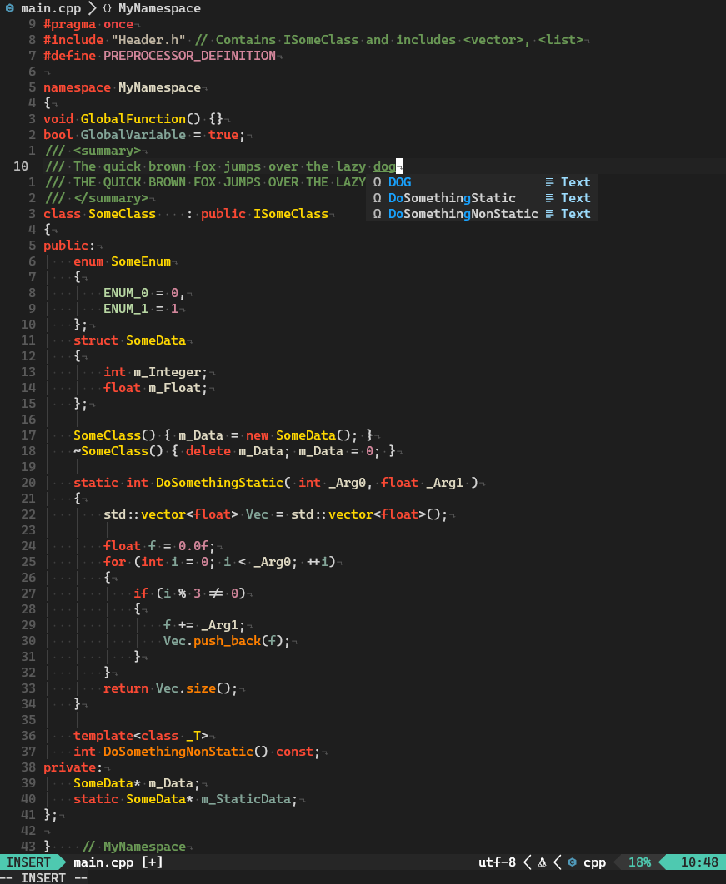

# gruv-vsassist.nvim

Neovim colour scheme strongly inspired by The Cherno's Visual Studio colour scheme. It's a mix of VSCode, VSAssist (Visual Assist - VS extension) and Gruvbox. 

Code based on [vsassist.nvim](https://github.com/BoHomola/vsassist.nvim) theme, which is based on [vscode.nvim](https://github.com/Mofiqul/vscode.nvim).

