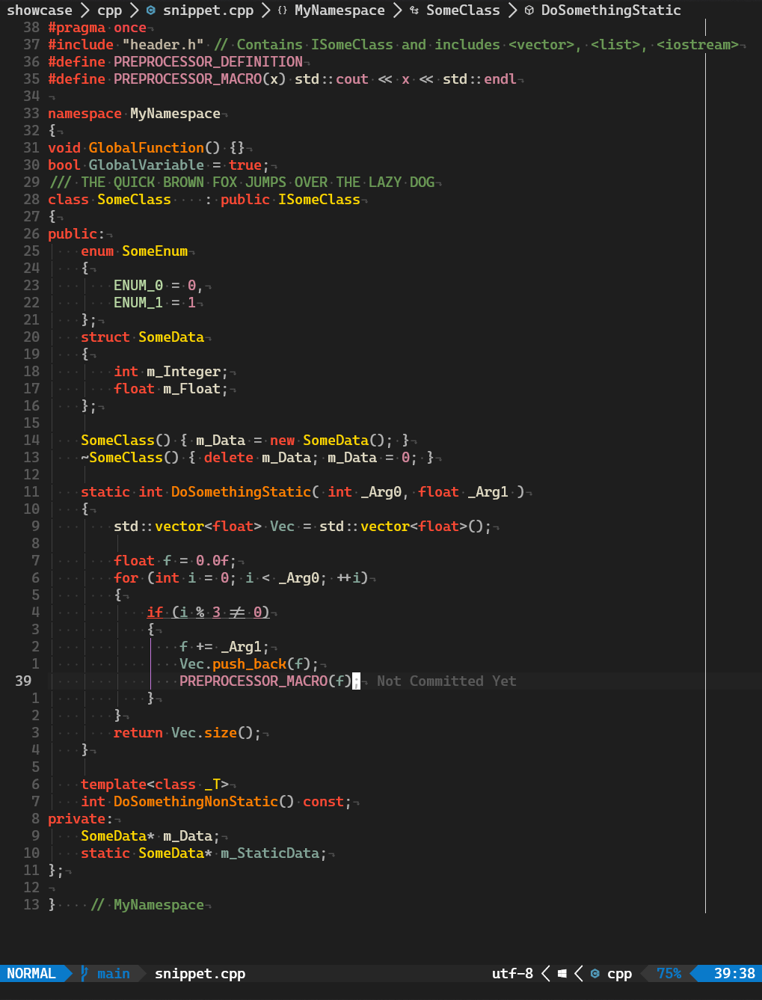

# gruv-vsassist.nvim

Neovim colour scheme strongly inspired by The Cherno's Visual Studio colour scheme. It's a mix of VSCode, VSAssist (Visual Assist - VS extension) and Gruvbox.

Code based on [vsassist.nvim](https://github.com/BoHomola/vsassist.nvim) theme, which is based on [vscode.nvim](https://github.com/Mofiqul/vscode.nvim). Pretty much the only difference to vscode.nvim are the syntax highlight colours (mostly set up for C/C++); remaining highlights (such as lua, typescript, js, css, etc.) remain default (vscode).

Scheme supports lsp semantic tokens.

## Preview




## Usage

Install via package manager

```lua
-- Packer:
use("bartekprtc/gruv-vsassist.nvim")
```

Config (same as in vscode.nvim):

```lua
require("gruv-vsassist").setup({
    -- Enable transparent background
    transparent = true,

    -- Enable italic comment
    italic_comments = true,

    -- Disable nvim-tree background color
    disable_nvimtree_bg = true,

    -- Override colors (see ./lua/gruv-vsassist/colors.lua)
    color_overrides = {
        vscLineNumber = '#FFFFFF',
    },
})
```


If you are using [`lualine`](https://github.com/hoob3rt/lualine.nvim), you can also enable the provided theme (also from vscode.nvim):

```lua
require('lualine').setup({
    options = {
        -- ...
        theme = 'gruv-vscode',
        -- ...
    },
})
```
